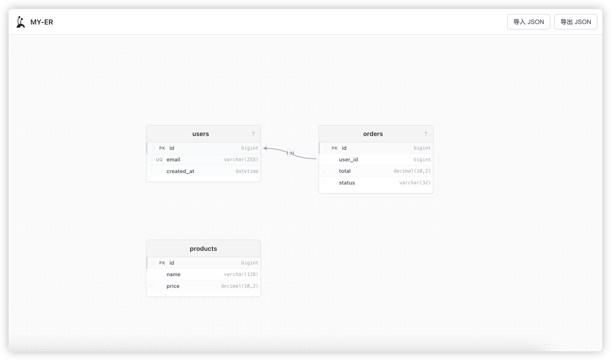

# MY-ER

基于 Web 的 **实体关系（ER）图可视化设计器**。在无限画布上拖拽建表、维护字段、绘制关系线；设计结果以 **JSON（`ErDiagram`）** 为唯一结构化载体，便于导入导出与后续对接 SQL、数据库等适配层。

## 功能概览

| 能力 | 说明 |
|------|------|
| 可视化建模 | 创建表、编辑表名/注释、增删改字段、拖拽排序字段 |
| 关系连线 | 支持 **表↔表**、**字段↔表**、**字段↔字段** 三种粒度；表级关系为虚线贝塞尔曲线 |
| 基数标注 | 关系线可切换 `1:1` / `1:N` / `N:1` / `N:M` |
| JSON 交换 | 工具栏导入/导出 `.json`，经校验后 `load` / `getDiagram` |
| 空白启动 | 默认空白画布；示例 ER 图见 `examples/shop-er.json`，可通过工具栏导入 |

## 示例预览

导入 `examples/shop-er.json` 后的画布效果：



## 架构原则

**画布只认 JSON**：画布层仅接受与产出 `ErDiagram`；SQL、数据库等外部能力经适配器与 JSON 双向转换，不直连画布内核。

```text
  SQL / 数据库 / 其他格式
           │
           ▼
    ┌──────────────┐
    │  IO 适配层    │  ← 规划中（SqlAdapter、DbAdapter）
    └──────────────┘
           │ ErDiagram JSON
           ▼
    ┌──────────────┐
    │  画布 Canvas  │  load / getDiagram
    └──────────────┘
```

详细需求与里程碑见 [docs/ER-DESIGNER-REQUIREMENTS.md](docs/ER-DESIGNER-REQUIREMENTS.md)。

## 技术栈

- [React](https://react.dev/) 19 + [Create React App](https://create-react-app.dev/)（[react-app-rewired](https://github.com/timarney/react-app-rewired)）
- [@antv/x6](https://x6.antv.antgroup.com/) + [@antv/x6-react-shape](https://x6.antv.antgroup.com/tutorial/intermediate/react)

## 快速开始

```bash
# 安装依赖
npm install

# 开发模式（默认 http://localhost:3000）
npm start

# 生产构建
npm run build

# 单元测试
npm test
```

## 项目结构

```text
src/
├── components/          # UI：画布、表节点、工具栏、对话框、右键菜单
├── canvas/              # X6 图实例、画布动作、图 ↔ 模型同步
├── graph/               # 连接桩、贝塞尔连接器、关系推断
├── model/               # ErDiagram 领域模型、校验、图数据转换
├── io/                  # JSON 文件读写
└── constants/           # 字段数据类型等
examples/shop-er.json           # 简单示例（商城 3 表）
examples/saas-platform-er.json  # 复杂示例（SaaS 22 表，含三种关系类型）
docs/                    # 需求与设计文档
```

## ErDiagram JSON 契约（摘要）

顶层结构：

```json
{
  "schemaVersion": "1.0.0",
  "metadata": { "name": "shop-er", "dialect": "mysql" },
  "tables": [ /* 表：id、name、comment、position、columns */ ],
  "relationships": [ /* 关系：kind、source、target、cardinality */ ]
}
```

- `relationships[].kind`：`table-table` | `field-table` | `field-field`
- `relationships[].cardinality`（可选）：`1:1` | `1:N` | `N:1` | `N:M`

完整字段约定与校验规则见 `src/model/erDiagram.js`、`src/model/validateDiagram.js`。

## 画布 API（概念层）

| 方法 | 说明 |
|------|------|
| `load(diagram)` | 全量加载并渲染；校验失败则拒绝 |
| `getDiagram()` | 返回当前模型快照 |
| `addTable` / `addField` 等 | 通过工具栏与画布内交互触发 |

## 路线图

- [x] Phase 1：画布建模、表/字段编辑、关系连线
- [x] JSON 导入导出与校验
- [ ] SqlAdapter：SQL ↔ JSON
- [ ] DbAdapter：数据库元数据 ↔ JSON（可选）

## 许可证

私有项目（`package.json` 中 `"private": true`）。
