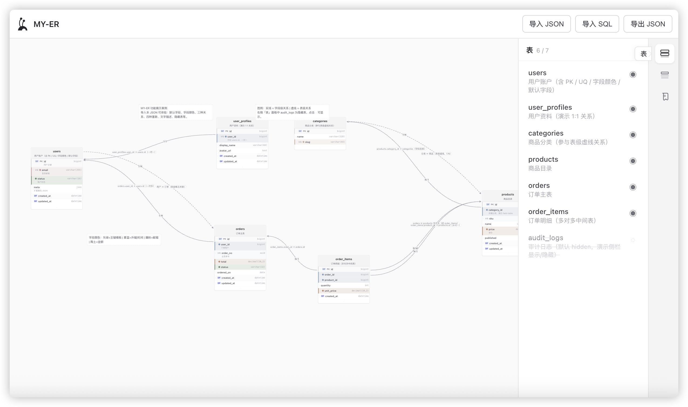

# MY-ER

基于 Web 的 **实体关系（ER）图可视化设计器**。在无限画布上拖拽建表、维护字段、绘制关系线，并用文字描述与字段颜色辅助阅读复杂模型。设计结果以 **JSON（`ErDiagram`）** 为唯一结构化载体，便于导入导出与后续对接 SQL、数据库等适配层。



## 功能总览

| 模块 | 能力 |
|------|------|
| 画布建模 | 建表、编辑表名/注释、字段增删改、拖拽排序、表节点拖拽定位 |
| 关系连线 | 表↔表、字段↔表、字段↔字段；基数标注与连线说明 |
| 文字描述 | 画布自由文字块，随 JSON 持久化 |
| 表列表侧栏 | 浏览全部表、定位选中、画布显示/隐藏 |
| 默认字段 | 跨表同名字段模板，统一维护与批量显示控制 |
| 字段颜色 | 莫兰迪预设标记 + 按色筛选高亮 |
| 数据交换 | JSON 导入/导出；SQL（DDL）导入 |
| 画布交互 | 平移、缩放、折叠表、连接桩拖线 |

---

## 画布与表建模

### 画布

- **空白启动**：默认无表；可通过工具栏导入 JSON/SQL，或参考 `examples/` 示例。
- **平移**：左键 / 右键拖拽空白区域，或滚轮（与缩放配合）。
- **缩放**：`Ctrl` + 滚轮，范围约 0.3×～2×。
- **网格**：点状背景，便于对齐表节点。

### 新建与编辑表

| 操作 | 方式 |
|------|------|
| 新建表 | 画布空白处 **右键 → 新建表**，在对话框填写表编码、注释及初始字段 |
| 编辑表信息 | 表头 **右键 → 编辑表信息**，可修改表名、注释及字段列表 |
| 移动表 | 拖拽表节点到任意位置，坐标写入 JSON |
| 新增字段 | 表头右键，或表底 **「+ 添加字段」** |
| 编辑字段 | 字段行 **右键 → 编辑字段信息** |
| 删除字段 | 字段行右键（危险操作） |
| 字段排序 | 在表内 **拖拽字段行** 调整顺序 |

### 字段属性

在「新增/编辑字段」对话框中可设置：

- **字段名**、**数据类型**（`int`、`bigint`、`varchar(255)`、`text`、`boolean`、`date`、`datetime`、`decimal(10,2)`、`json`、`uuid` 等预设）
- **说明**（comment）
- **主键（PK）**、**唯一（UQ）**、**可空**（主键时自动不可空）
- **字段颜色**（见下文「字段颜色」）

表节点上对主键、唯一约束显示 **PK / UQ** 角标；关联默认字段的列显示 **默** 标记。

### 折叠与隐藏

| 能力 | 说明 |
|------|------|
| **折叠字段** | 表头右键 → 折叠字段：仅保留 **已有连线** 的字段行，缩小大表占地 |
| **展开字段** | 折叠后再次右键可展开全部字段 |
| **从画布隐藏** | 表头或右侧「表列表」中隐藏：表仍保留在模型与 JSON 中，画布不渲染，便于聚焦子集 |

---

## 关系连线

从表节点 **连接桩** 拖出连线至另一表或字段桩，系统自动推断关系类型：

| 连接方式 | `kind` | 线型 |
|----------|--------|------|
| 表桩 → 表桩 | `table-table` | 虚线二次贝塞尔 |
| 字段桩 ↔ 表桩 | `field-table` | 实线三次贝塞尔 |
| 字段桩 ↔ 字段桩 | `field-field` | 实线三次贝塞尔 |

新建关系默认基数为 **`1:N`**。

| 操作 | 方式 |
|------|------|
| 切换基数 | **单击** 关系线，在 `1:1` → `1:N` → `N:1` → `N:M` 间循环 |
| 编辑连线说明 | **双击** 关系线，或 **右键 → 编辑连线说明** |
| 切换基数（菜单） | 关系线 **右键 → 切换关系基数** |

基数与说明会序列化进 JSON，导入后原样恢复。

---

## 文字描述

用于在图上补充业务说明、分区标题等，不参与表结构校验。

| 操作 | 方式 |
|------|------|
| 添加 | 画布空白 **右键 → 添加文字描述**，随即进入编辑 |
| 编辑 | **双击** 文字块；编辑中 **Esc** 取消 |
| 移动 | 拖拽文字节点 |
| 删除 | 文字块 **右键 → 删除** |

`annotations` 数组随 JSON 一并导入导出。

---

## 右侧边栏

主界面右侧为图标轨道，点击展开对应面板（再次点击收起）。

### 表列表

- 列出当前图中全部表（含已隐藏），显示 **可见数 / 总数**。
- **单击** 表项：画布选中并定位该表。
- **可见性按钮** 或 **右键**：在画布显示 / 隐藏。
- **右键 → 编辑表信息**：打开表编辑对话框（与画布表头菜单一致）。

### 默认字段

跨表复用的字段模板（如 `id`、`created_at`）：

- 在任意字段行 **右键 → 加入默认字段**：按 **字段名（不区分大小写）** 关联各表中同名列；已关联列显示 **默** 标记。
- **移出默认字段**：解除该列与模板的关联，不删除列本身。
- **在画布显示默认字段**：关闭后，所有已关联的默认字段行在表节点中隐藏（模型仍保留）。
- 在侧栏 **点击模板项** 可编辑名称、类型、说明、主键/唯一/可空；**保存后同步到全部关联列**。
- 可 **移除** 模板项（仅删模板，不删各表字段）。

模板保存在 `metadata.defaultFields`。

### 字段颜色

- **筛选**：按已使用的颜色筛选；画布仍显示全部字段行，仅 **高亮** 匹配颜色的标记，便于查看分布。
- **配色**：查看 8 种莫兰迪预设色及色值，供字段右键「设置颜色」或编辑字段时选用。

设置颜色：**字段右键 → 设置颜色**（色板弹层），或编辑字段对话框；**清除颜色** 同菜单。

---

## 导入与导出

### JSON（工具栏）

| 按钮 | 说明 |
|------|------|
| **导入 JSON** | 选择 `.json`，经 `normalizeDiagram` + `validateDiagram` 校验后 `load` 到画布 |
| **导出 JSON** | 导出前校验；文件名取自 `metadata.name`（非法字符替换为 `_`） |

### SQL（工具栏 → 导入 SQL）

- **粘贴 DDL** 或 **选择一个或多个 `.sql` 文件**（多文件内容合并解析）。
- 解析 `CREATE TABLE`、列定义、`PRIMARY KEY` / `UNIQUE`、**外键**（生成 `field-field` / `field-table` 关系）。
- 支持剔除 `--` 与 `/* */` 注释。
- 导入后表按网格自动排版；`metadata.dialect` 默认为 `mysql`。
- **暂不支持** JSON → SQL 导出（见路线图）。


---

## 架构原则

**画布只认 JSON**：画布层仅接受与产出 `ErDiagram`；SQL、数据库等外部能力经适配器与 JSON 双向转换，不直连画布内核。

```text
  SQL / 数据库 / 其他格式
           │
           ▼
    ┌──────────────┐
    │  IO 适配层    │  SqlAdapter（导入）、DbAdapter（规划中）
    └──────────────┘
           │ ErDiagram JSON
           ▼
    ┌──────────────┐
    │  画布 Canvas  │  load / getDiagram
    └──────────────┘
```

## 技术栈

- [React](https://react.dev/) 19 + [Create React App](https://create-react-app.dev/)（[react-app-rewired](https://github.com/timarney/react-app-rewired)）
- [@antv/x6](https://x6.antv.antgroup.com/) + [@antv/x6-react-shape](https://x6.antv.antgroup.com/tutorial/intermediate/react)

## 快速开始

```bash
# 安装依赖
npm install

# 开发模式（默认 http://localhost:3000）
npm start

# 生产构建
npm run build

# 单元测试
npm test
```

## 项目结构

```text
src/
├── components/          # UI：画布、表节点、工具栏、对话框、侧栏、字段颜色
├── canvas/              # X6 图实例、画布动作、图 ↔ 模型同步
├── graph/               # 连接桩、贝塞尔路由、关系推断、边标签
├── model/               # ErDiagram 领域模型、校验、默认字段、展示逻辑
├── io/                  # JSON / SQL 读写与 SqlAdapter
├── constants/           # 数据类型、字段颜色预设
└── theme.js             # 画布主题色
examples/                # shop-er、saas-platform-er 等示例
```

## ErDiagram JSON 契约（摘要）

顶层结构：

```json
{
  "schemaVersion": "1.0.0",
  "metadata": {
    "name": "shop-er",
    "dialect": "mysql",
    "defaultFields": []
  },
  "tables": [],
  "relationships": [],
  "annotations": []
}
```

**表 `tables[]`**

| 字段 | 说明 |
|------|------|
| `id`, `name`, `comment` | 标识与展示名 |
| `position` | `{ x, y }` 画布坐标 |
| `columns[]` | 字段列表 |
| `hidden` | `true` 时不在画布显示 |

**字段 `columns[]`**

| 字段 | 说明 |
|------|------|
| `name`, `dataType`, `comment` | 基本信息 |
| `nullable`, `primaryKey`, `unique` | 约束 |
| `defaultValue` | 默认值（可选） |
| `color` | `#RRGGBB` 标记色（可选） |
| `defaultFieldId` | 关联默认字段模板 id（可选） |

**关系 `relationships[]`**

| 字段 | 说明 |
|------|------|
| `kind` | `table-table` \| `field-table` \| `field-field` |
| `source` / `target` | `{ tableId, columnId? }` |
| `cardinality` | `1:1` \| `1:N` \| `N:1` \| `N:M`（可选） |
| `comment` | 连线说明文字（可选） |

**文字 `annotations[]`**

| 字段 | 说明 |
|------|------|
| `id`, `text`, `position` | 标识、内容与坐标 |
| `width`, `height` | 尺寸（可选） |

完整约定与校验规则见 `src/model/erDiagram.js`、`src/model/validateDiagram.js`。

## 画布 API（概念层）

| 方法 | 说明 |
|------|------|
| `load(diagram)` | 全量加载并渲染；校验失败则拒绝 |
| `getDiagram()` | 返回当前模型快照（含位置、关系、注释、默认字段等） |
| `addTable` / `selectTable` / `setTableHidden` 等 | 由画布内交互与侧栏调用 |

## 路线图

- [x] Phase 1：画布建模、表/字段编辑、关系连线、文字描述
- [x] JSON 导入导出与校验
- [x] 表列表、默认字段、字段颜色与筛选
- [x] SqlAdapter：SQL → JSON（`CREATE TABLE` + 外键）
- [ ] JSON → SQL 导出
- [ ] DbAdapter：数据库元数据 ↔ JSON（可选）

## 许可证

私有项目（`package.json` 中 `"private": true`）。
